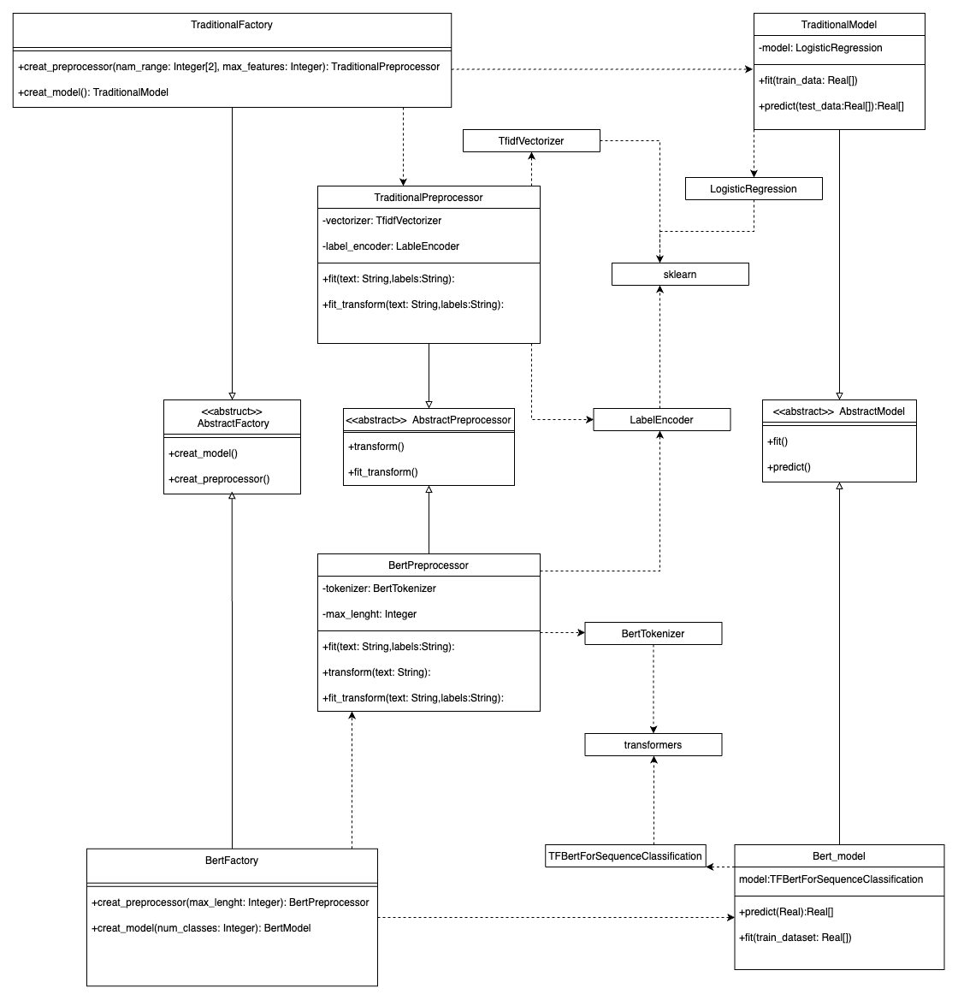

# Machine Learning Abstract Factory

ML-Abstract-Factory — это библиотека, реализующая паттерн проектирования "Абстрактная фабрика" для создания компонентов конвейера машинного обучения. Она позволяет гибко переключаться между различными подходами к обработке текста и классификации, сохраняя единый интерфейс взаимодействия.

## Project Structure

ml-abstract-factory/
├── src/                     # Исходный код проекта
│   ├── abstract/            # Абстрактные базовые классы
│   │   ├── factory.py       # Абстрактная фабрика
│   │   ├── model.py         # Абстрактная модель
│   │   └── preprocessor.py  # Абстрактный препроцессор
│   │
│   ├── factories/           # Конкретные реализации фабрик
│   │   ├── bert_factory.py  # Фабрика для BERT-моделей
│   │   └── traditional_factory.py  # Фабрика для классических ML-моделей
│   │
│   ├── models/              # Реализации моделей
│   │   ├── bert_model.py    # Модель на основе BERT
│   │   └── traditional_model.py  # Классические алгоритмы ML
│   │
│   ├── preprocessors/       # Реализации препроцессоров
│       ├── bert_preprocessor.py  # Токенизатор для BERT
│       └── traditional_preprocessor.py  # Классический препроцессор (TF-IDF и LE)
│
├── examples/                # Примеры использования
│   ├── bert_example.py      # Пример с BERT
│   └── traditional_example.py  # Пример с LogReg и TF-IDF
│
└── README.md                # Основная документация

